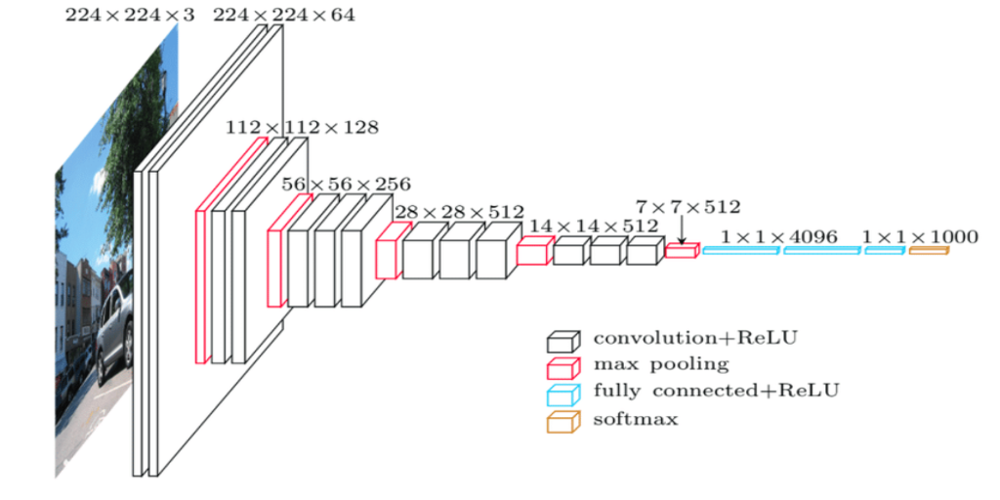
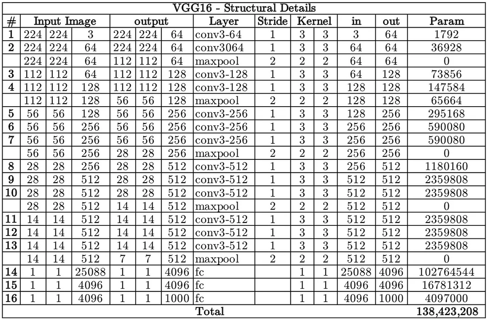
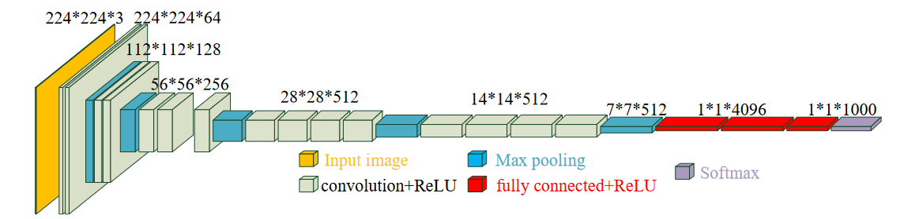
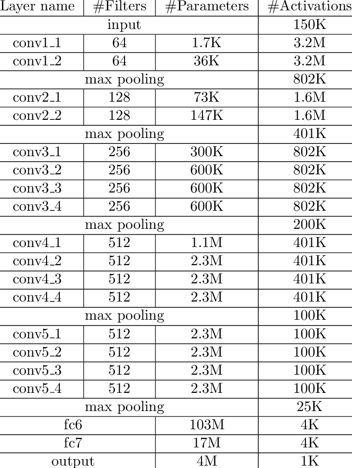
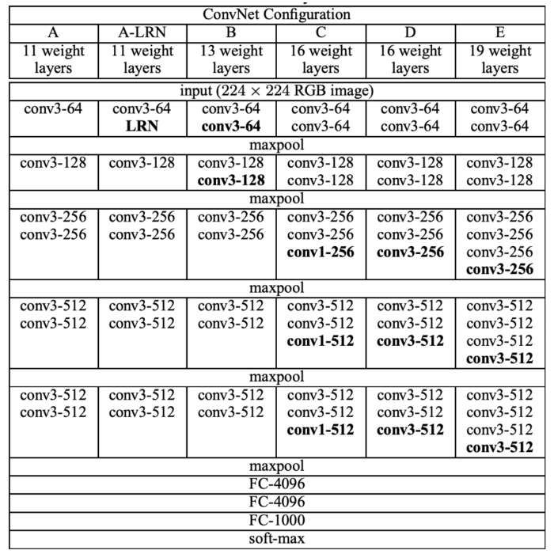

# VGG(Visual Geometry Group) Networks

We use and explain VGG16 and VGG19 architectures in this repository

## VGG16

VGG16 refers to the VGG model, also called VGGNet. It is a convolution neural network (CNN) model supporting 16 layers. K. Simonyan and A. Zisserman from Oxford University proposed this model and published it in a paper called  
Very Deep Convolutional Networks for Large-Scale Image Recognition. The VGG16 model can achieve a test accuracy of 92.7% in ImageNet, a dataset containing more than 14 million training images across 1000 object classes. 
It is one of the top models from the ILSVRC-2014 competition.

VGG16 improves on AlexNet and replaces the large filters with sequences of smaller 3×3 filters. In AlexNet, the kernel size is 11 for the first convolutional layer and 5 for the second layer. The researchers trained the VGG model  
for several weeks using NVIDIA Titan Black GPUs.

In summary:

- All configurations of VGG have block structures.
- Each VGG block consists of a sequence of convolutional layers which are followed by a max-pooling layer. The same kernel size (3 × 3) is applied over all convolutional layers. Besides, the authors used a padding size of 1 to keep the size of the output after each convolutional layer. A max-pooling of size 2 × 2 with strides of 2 is also applied to halve the resolution after each block
- Each VGG model has two fully connected hidden layers and one fully connected output layer.

The number of parameters in vgg16 is as follows:

## VGG19

VGG19 is a variant of the VGG model which in short consists of 19 layers (16 convolution layers, 
3 Fully connected layer, 5 MaxPool layers and 1 SoftMax layer). There are other variants of VGG  
like VGG11, VGG16 and others. VGG19 has 19.6 billion FLOPs.

The number of parameters in vgg16 is as follows:

The VGG model investigates the depth of layers with a very small convolutional filter size (3 × 3) 
to deal with large-scale images. The authors released a series of VGG models with different layer  
lengths, from 11 to 19, which is presented in the following table:

# Installation

1. Install python

- requirement version 3.x **x = {7,8,9, 10}**

2. Create virtual environment

- pip install virtualenv
- python -m venv {name of virtual environment}
- activate it 
- 1. On Windows: C:/path to your env/Scripts/activate
- 2. On Linux: path to your env/bin/activate

3. `pip install -r requirements.txt`

# Features

### Deep Learning

- architectures are built using [tensorflow](https://github.com/tensorflow/tensorflow.git)
- run in colab 
